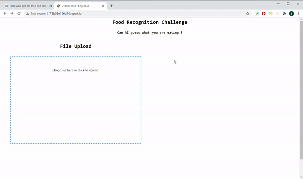

## The MaskRCNN Web App

This repo contains code to serve a Matterport MaskRCNN model as a webapp for easy visualization of results on web server.

To demo this WebApp you can run the colab notebook present [here](https://colab.research.google.com/drive/1AQ2mY0vlqVIUFefXzqaKD0e89k7LpBtu?usp=sharing), which will take care of all required dependencies.

You may also run it on your local system by commenting lines #6 and #51 in app.py and running the following commands (preferably in a new conda environment)

`pip install -r requirements.txt`

`python app.py`

You may easily modify this code to serve models built using different libraries by making appropriate changes to the `predict_on_image(uploaded_file)` function in line #91.
